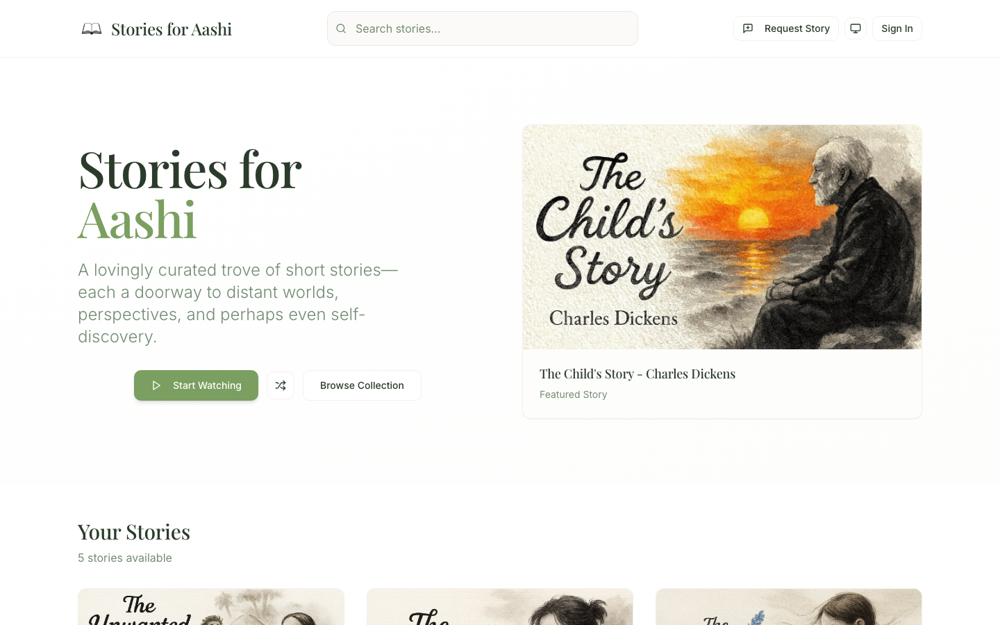

# Stories for Aashi

**A lovingly curated trove of short stories, built as a birthday gift. [storiesforaashi.com](https://storiesforaashi.com)**

I built this for my partner as a birthday gift in two weeks, August 2025. Each story is a doorway to a distant world, illustrated and read, with a back-channel where she can ask me for new ones.

It started in Lovable.dev, the first time I used a non-Claude-Code AI builder for something I meant to ship. When the patterns got serious, I moved it to a full-repo setup and finished it there.

## What's under the hood

- **Real auth** with Google sign-in, and a full user lifecycle: account deletion and reactivation, not just a login form.
- **Row-level security** tightened gradually across fourteen Supabase migrations, so each account only ever sees its own data.
- **A request back-channel**: an account-holder asks for a new story, and I get an email. The ask-and-deliver loop is part of the gift.
- **A YouTube playlist sync**: a Supabase edge function pulls new readings on a schedule so the collection grows without a redeploy.

Sixty-six commits in. It degrades gracefully, and nothing sensitive lives in the client: the YouTube and service keys are read from environment variables, and the only Supabase key in the browser is the publishable anon key that row-level security is designed around.

Stack: Vite, React, TypeScript, Tailwind, shadcn/ui, Supabase, TanStack Query, React Router.

## License

AGPL-3.0, see [LICENSE](LICENSE). You're free to use, study, and modify it, including commercially; if you run a modified version as a network service, you must release your source under the same terms.

---

Part of [horizonfall.com](https://horizonfall.com). The full story is at **[horizonfall.com/projects/stories-for-aashi](https://horizonfall.com/projects/stories-for-aashi)**.
